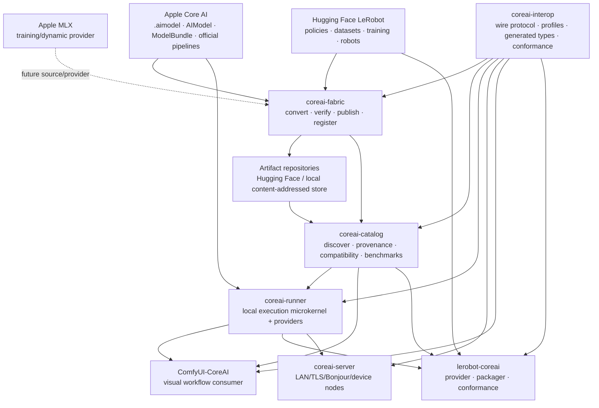

# RFC-0000 — Core AI Ecosystem Architecture and Repository Boundaries

> **Status:** Proposed  
> **Date:** 2026-07-12  
> **Target:** Apple-first, upstream-compatible Core AI ecosystem  
> **Normative language:** MUST, MUST NOT, SHOULD, SHOULD NOT and MAY are used as in RFC 2119.  
> **Snapshot:** See `SOURCE-SNAPSHOT.md`. The RFCs describe the target architecture; they do not claim that unfinished capabilities already exist.


## 1. Executive decision

The ecosystem MUST be designed as an **Apple-native deployment and interoperability layer**, not as a competing model format, a replacement for Apple's Core AI APIs, or a fork of upstream application frameworks.

The authoritative layers are:

1. **Apple** owns the native artifact and runtime substrate: `.aimodel`, `.aimodelc`, `AIModel`, `InferenceFunction`, `NDArray`, Core AI compilation, the official `ModelBundle` metadata format, official pipelines, and reference recipes.
2. **Upstream domain projects** own domain semantics:
   - Hugging Face LeRobot owns robot-learning workflows, policies, datasets, processors, robot interfaces, evaluation and training semantics.
   - ComfyUI owns graph workflow and node semantics.
   - MLX owns its array, training and dynamic execution semantics.
3. **This ecosystem** owns the missing connective tissue:
   - discovery and provenance;
   - reproducible conversion;
   - a reusable local runtime service;
   - cross-process interoperability;
   - consumer integrations;
   - conformance, evidence and honest compatibility claims.

The ecosystem SHALL contain six existing repositories and one mandatory new repository:

| Repository | Decision | Responsibility |
|---|---|---|
| `coreai-catalog` | Keep | Discovery, normalized metadata, provenance, compatibility and benchmark index |
| `coreai-fabric` | Keep; modularize | Conversion orchestration, parity, publication and catalog registration |
| `coreai-runner` | Keep; refactor into microkernel + profiles | Local Swift execution, lifecycle, sessions, cache, telemetry and service boundary |
| `coreai-server` | Keep; defer product expansion | Authenticated LAN exposure and device-node coordination |
| `SAL2-Dev/ComfyUI-CoreAI` | Keep | Thin ComfyUI consumer and UX integration |
| `lerobot-coreai` | Keep; narrow positioning | LeRobot Core AI provider, packager and conformance/certification suite |
| **`coreai-interop`** | **Create** | Cross-repository wire contracts, namespaced profiles, generated types and conformance fixtures |

No additional repository is mandatory at this stage. In particular:

- MUST NOT create a competing `coreai-spec`.
- MUST NOT create `coreai-runner-robot` or `coreai-fabric-robot`.
- MUST NOT create a second LeRobot fork.
- MUST NOT create an MLX bridge repository before a concrete provider implementation and ownership model exist.
- Cross-repository RFCs SHOULD initially live under `coreai-interop/rfcs/`; a separate governance repository MAY be split later only after measurable maintenance pressure.

## 2. Problem statement

The current repositories already form a useful ecosystem, but their contracts evolved independently. This has created predictable integration debt:

- the Runner's request schema and `lerobot-coreai` client disagree on where `observation` lives;
- the Runner advertises action and host-loop support while returning HTTP 501 for action inference;
- the Runner's universal request/output objects accumulate domain-specific fields;
- ComfyUI and the Runner independently parse Catalog data;
- ComfyUI and LeRobot default to the same global Unix socket and may fight over process ownership;
- the Fabric base schema contains action-specific semantics and still has inference-by-name paths;
- Catalog uses central closed enums where extensible, versioned profiles are needed;
- Runner and Server public documentation lag behind their implementations;
- the Runner currently treats community CoreAIKit as its foundation even though Apple now publishes official runtime utilities and bundle conventions;
- the LeRobot path has excellent evidence architecture but still needs the real Swift Runner + real `.aimodel` production chain.

The architecture MUST remove these contradictions while preserving the velocity and independent usability of each repository.

## 3. Non-goals

This RFC does not propose:

- a new tensor runtime;
- a replacement for Core AI, MLX, PyTorch, LeRobot or ComfyUI;
- a universal model ontology covering every AI domain;
- a hosted model registry or weight mirror;
- robot hardware drivers inside Runner or Fabric;
- training inside Core AI;
- unrestricted robot actuation;
- a distributed cluster scheduler in the first Server release;
- automatic trust of arbitrary community artifacts.

## 4. First principles

### 4.1 Native before wrapper

For any operation, implementations MUST prefer this order:

1. Official Apple framework or utility.
2. Direct generic Core AI primitives (`AIModel`, named functions, `NDArray`).
3. A community provider isolated behind a provider interface.
4. A custom implementation only when the first three cannot satisfy the contract.

### 4.2 Profiles, not god objects

The common kernel MUST contain only semantics shared by every domain:

- artifact identity;
- named inputs and outputs;
- functions or execution plans;
- sessions and reset;
- batching;
- deadlines and cancellation;
- telemetry;
- capability discovery;
- errors and version negotiation.

LLM, VLM, diffusion, vision and action-specific concepts MUST live in versioned profiles.

### 4.3 First-class extensions, not core special cases

Action/robot-learning support MUST be first-party, tested in the principal CI and released with the ecosystem, but MUST remain an extension:

- `CoreAIActionProfile` in Runner;
- `action` profile in Fabric;
- `org.huggingface.lerobot.policy.v1` consumer profile;
- action records in Catalog;
- complete LeRobot semantics in `lerobot-coreai`.

### 4.4 Truthful capabilities

A capability is a runtime fact, not a roadmap declaration. A service MUST NOT advertise an operation unless a conformance test proves that the operation succeeds on the current build.

### 4.5 Fail closed at trust boundaries

Unknown or unverifiable information MUST remain unknown or unavailable. It MUST NOT be inferred from:

- artifact names;
- model IDs;
- repository names;
- capability marketing text;
- optional booleans supplied by callers.

### 4.6 One authority for each fact

| Fact | Authority |
|---|---|
| Core AI artifact/runtime semantics | Apple |
| Model and artifact discovery records | Catalog |
| Conversion recipe and produced bytes | Fabric build receipt |
| Runtime execution fact | Runner receipt |
| LeRobot feature/policy semantics | LeRobot + `lerobot-coreai` profile |
| ComfyUI node behavior | ComfyUI-CoreAI |
| LAN identity and authorization | Server |
| Shared HTTP/profile wire shape | `coreai-interop` |
| Benchmark measurement | Signed measurement record, indexed by Catalog |

## 5. Target architecture



## 6. Dependency rules

The following dependency graph is normative:

```text
coreai-interop
   ↑          ↑          ↑
Catalog    Fabric     Runner
                         ↑
                 Server / Consumers
```

Additional rules:

- Fabric MAY depend on Catalog schemas only through a released compatibility package or `coreai-interop`; it MUST NOT scrape Catalog internals.
- Catalog MUST NOT import Fabric.
- Runner MUST NOT import LeRobot or ComfyUI.
- `lerobot-coreai` MAY depend on LeRobot, the generated Python interop client and optionally Fabric.
- ComfyUI-CoreAI MAY depend on the generated Python interop client, but MUST NOT duplicate the Runner protocol.
- Server MUST import the Runner library in-process; it SHOULD NOT proxy to a local Runner HTTP service.
- Runner MUST be able to execute an artifact by local path and digest without requiring Catalog network availability.
- Catalog use in Runner is a discovery/download convenience, not a runtime prerequisite.

## 7. Artifact model

### 7.1 Native Apple assets remain native

The ecosystem MUST preserve official assets unchanged whenever possible:

- `.aimodel`;
- `.aimodelc`;
- Apple `ModelBundle` directories using `metadata_version: 0.2`;
- official pipeline-specific resources.

### 7.2 Domain composition uses an outer profile bundle

Domains not represented by Apple's current `BundleKind`, such as action policies, MUST use an outer bundle without falsifying Apple's metadata.

Example:

```text
ACT-SO101.coreaipolicy/
├── policy.json
├── components/
│   └── main.aimodel
├── contracts/
│   ├── feature-contract.json
│   ├── processor-stage-contract.json
│   └── policy-execution-contract.json
├── resources/
│   └── normalization.json
└── evidence/
    ├── conversion.json
    └── parity.json
```

`policy.json` MUST use a namespaced schema such as:

```json
{
  "schema": "org.huggingface.lerobot.coreai-policy.v1",
  "profile": "coreai.action.v1",
  "policy_family": "act",
  "components": {
    "main": {
      "format": "apple.aimodel",
      "path": "components/main.aimodel",
      "sha256": "sha256:..."
    }
  }
}
```

This outer bundle composes Apple-native assets; it does not redefine them.

## 8. Runtime provider model

Runner SHALL expose providers behind a common internal interface:

```swift
public protocol RuntimeProvider: Sendable {
    var id: ProviderID { get }
    func probe(artifact: ArtifactDescriptor) async -> ProviderProbe
    func load(artifact: VerifiedArtifact, options: LoadOptions) async throws -> ModelSession
}
```

Required provider families:

1. `AppleRawAIModelProvider`
2. `AppleOfficialBundleProvider`
3. `AppleOfficialPipelinesProvider`
4. `CommunityCoreAIKitProvider`
5. `ActionPolicyProvider`

Provider selection MUST be explicit and observable. Catalog MAY recommend a provider, but Runner MUST independently probe and verify it.

## 9. Interoperability protocol

The shared wire kernel SHALL use named values rather than a growing union of optional domain fields.

Request skeleton:

```json
{
  "protocol_version": "coreai.runner.v1",
  "request_id": "uuid",
  "artifact": {
    "id": "act-so101",
    "root_sha256": "sha256:..."
  },
  "profile": "coreai.action.v1",
  "inputs": {
    "observation.state": {
      "kind": "tensor",
      "dtype": "float32",
      "shape": [6],
      "inline": [0, 0, 0, 0, 0, 0]
    }
  },
  "execution": {
    "session_id": "uuid",
    "deadline_ms": 100,
    "compute_policy": "auto"
  }
}
```

Response skeleton:

```json
{
  "protocol_version": "coreai.runner.v1",
  "request_id": "uuid",
  "outputs": {
    "action": {
      "kind": "tensor",
      "dtype": "float32",
      "shape": [50, 6],
      "blob": {"sha256": "sha256:...", "media_type": "application/x-safetensors"}
    }
  },
  "telemetry": {
    "provider": "apple.raw-aimodel",
    "load_ms": 0,
    "inference_ms": 12.4,
    "thermal_state": "nominal"
  }
}
```

Convenience endpoints MAY exist, including OpenAI-compatible chat and `/v1/action/predict`, but they MUST adapt to the common kernel.

## 10. Capability model

Capabilities MUST be structured, versioned and test-derived:

```json
{
  "protocol_versions": ["coreai.runner.v1"],
  "profiles": {
    "coreai.language.v1": {"status": "conformant"},
    "coreai.action.v1": {"status": "unavailable", "reason": "provider_not_built"}
  },
  "features": {
    "sessions": true,
    "cancellation": true,
    "native_batching": false
  }
}
```

Forbidden:

```json
{"supports": {"action": true, "host_loop": true}}
```

when the endpoint returns 501.

## 11. Catalog federation

Catalog SHALL normalize sources, not privilege one hosting path:

- Apple registry and `apple/coreai-models`;
- Fabric outputs;
- community model zoos;
- independent Hugging Face artifacts;
- manually submitted verified artifacts;
- future MLX providers.

Each record SHOULD expose compatibility levels:

| Level | Meaning |
|---|---|
| A0 | Native artifact opens through official Core AI |
| A1 | Official Apple bundle validates |
| A2 | Official Apple pipeline executes |
| A3 | Runner profile conforms |
| A4 | A named consumer conforms |
| A5 | Conversion and execution evidence are independently verifiable |

## 12. Training and MLX

Training SHALL remain outside Core AI.

Supported routes:

```text
LeRobot + PyTorch MPS → checkpoint → Fabric → Core AI
LeRobot-compatible MLX provider → checkpoint → Fabric or MLX runtime
```

The ecosystem MUST define a runtime-provider boundary compatible with a future MLX provider, but MUST NOT build a second LeRobot port. Existing community work such as LeRobot-MLX SHOULD be evaluated through conformance tests before integration.

## 13. Security and provenance

All production artifact flows MUST provide:

- immutable source revision;
- per-file digest or Merkle root;
- converter/toolchain identity;
- recipe bytes;
- verification report;
- license/source attribution;
- runner binary identity;
- runtime receipt;
- signed trust policy for production claims.

ComfyUI auto-download MUST fail closed if a binary signature or checksum cannot be verified. Server MUST use authenticated and encrypted transport before leaving localhost.

## 14. Release train

A release BOM SHALL record compatible versions:

```yaml
ecosystem_release: 2026.10
interop: 1.0.0
catalog: 3.0.0
fabric: 0.2.0
runner: 1.0.0
server: 0.1.0
comfyui_coreai: 1.0.0
lerobot_coreai: 1.4.0
apple_coreai_models_revision: "..."
lerobot_range: ">=0.6,<0.7"
```

Cross-repo CI MUST test the BOM rather than unpinned `main` branches.

## 15. Bloat prevention rules

A feature belongs in the common core only if all are true:

1. At least two independent profiles require it.
2. It can be expressed without domain vocabulary.
3. It has a stable conformance test.
4. Removing every domain extension still leaves the feature meaningful.

Otherwise it belongs in a profile or consumer.

## 16. Migration order

1. Create `coreai-interop` with current protocol captured as fixtures.
2. Fix truth defects without redesign:
   - Runner action capability false until implemented.
   - Align Python and Swift request payloads.
   - Unique socket ownership.
   - Fail-closed binary verification.
3. Generate Swift/Python protocol types.
4. Refactor Runner into providers and a common invocation kernel.
5. Refactor Fabric into profile drivers.
6. Add Catalog profile references and A0–A5 compatibility.
7. Migrate ComfyUI and LeRobot clients.
8. Complete real Action Runtime with ACT.
9. Build Server security and remote execution.
10. Add protected production signing and full-chain certification.

## 17. Ecosystem Definition of Done

The first ecosystem-wide milestone is complete only when:

- one ACT checkpoint is converted by Fabric;
- the artifact is published with immutable provenance;
- Catalog indexes it with action and LeRobot profiles;
- Runner loads the real `.aimodel` through an Apple-native provider;
- `lerobot-coreai` executes the official five-case matrix against that Runner;
- ComfyUI remains unaffected and passes its conformance suite;
- Server can optionally expose the same Runner library without protocol divergence;
- all components use one released interop contract;
- capabilities are generated from passing conformance tests;
- a release BOM pins every component;
- no physical-safety claim is made.

## 18. Rejected alternatives

### One monolithic repository

Rejected because domain release cadence, languages and consumer ownership differ.

### A separate repository for every runtime profile

Rejected until dependency weight or maintainership requires independent packages.

### CoreAIKit as the only runtime foundation

Rejected because official Apple utilities must be first-class. CoreAIKit remains a valuable community provider.

### Replacing LeRobot with local policy semantics

Rejected. LeRobot remains authoritative.

### Treating Core AI as a training framework

Rejected. Training uses PyTorch MPS or MLX.
