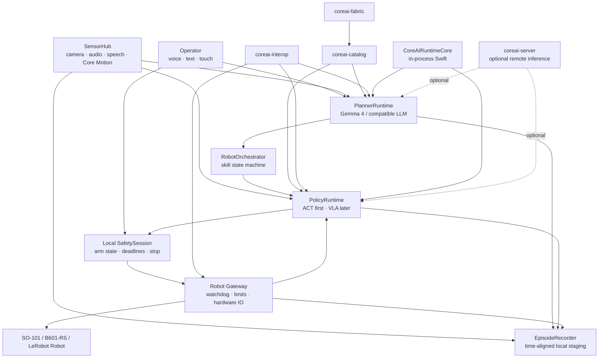

# RFC-0900 — `lerobot-coreai-apple`: Apple-Native Robot Brain Application

> **Status:** Proposed  
> **Date:** 2026-07-12  
> **Target:** iPhone/iPad/Mac application for sensor capture, local planning, Core AI policy execution, safe robot orchestration and LeRobot-compatible recording  
> **Normative language:** MUST, MUST NOT, SHOULD, SHOULD NOT and MAY are used as in RFC 2119.  
> **Snapshot:** See `SOURCE-SNAPSHOT.md`. This RFC defines a target product and does not claim that the complete mobile robot-brain path already exists.


## 1. Decision

Create one additional public repository dedicated to robotics:

```text
kevinqz/lerobot-coreai-apple
```

The product name MAY change before public release, but the repository responsibility MUST remain stable.

The repository SHALL implement an Apple-native application and reusable Swift package that can:

- acquire synchronized camera, microphone, speech, text and Core Motion inputs;
- receive robot joint state and hardware telemetry from a separate gateway;
- run a language planner such as Gemma 4 through Core AI;
- run a LeRobot policy artifact such as ACT through Core AI;
- convert planner output into a constrained skill request;
- convert policy output into bounded action chunks;
- transmit those chunks to a fail-safe robot gateway;
- expose explicit arm/disarm, stop and session controls;
- record synchronized episodes suitable for conversion to `LeRobotDataset`;
- operate without Python or PyTorch in the shipping iOS application.

The app is a specialized consumer of the Core AI ecosystem. It is not a replacement for LeRobot, the Runner, the Server, the Fabric, the Catalog, or Ditto.

## 2. Relationship to Ditto

Ditto remains a general-purpose application that can use the same Core AI ecosystem for broad multimodal workflows.

`lerobot-coreai-apple` MUST be a separate product because robotics introduces obligations that a general-purpose app SHOULD NOT inherit:

- deterministic session state;
- synchronized sensor and joint-state capture;
- real-time deadlines;
- action sequence numbering;
- independent watchdog behavior;
- explicit arming and physical e-stop UX;
- hardware pairing;
- robot-specific permissions and onboarding;
- episode recording;
- safety evidence and bounded real-world egress.

The two apps MAY share released Swift packages, generated interop types, model providers and design components. They MUST NOT share hidden application state, process ownership or undocumented private protocols.

## 3. Product positioning

Recommended positioning:

> An Apple-native robot-brain application that lets an iPhone see, hear, understand and execute LeRobot policies through Core AI while a separate gateway protects and controls the physical robot.

The application is not “LeRobot fully ported to iOS.” It is a deployment and interaction surface for LeRobot-compatible policies.

LeRobot remains authoritative for:

- training;
- policy implementations;
- dataset semantics;
- robot interfaces;
- processor semantics;
- evaluation semantics;
- upstream model compatibility.

The app owns:

- Apple sensor acquisition;
- local Core AI runtime composition;
- planner/policy orchestration;
- mobile UX;
- session lifecycle;
- secure gateway communication;
- local episode staging;
- device-specific performance and reliability.

## 4. Non-goals

The first product SHALL NOT:

- train a policy on the iPhone;
- execute arbitrary Python;
- reproduce the complete LeRobot CLI;
- speak directly to servo buses from the phone;
- treat a language model as a motor controller;
- claim physical safety certification;
- permit unrestricted background actuation;
- expose an unauthenticated robot-control endpoint;
- require a local HTTP daemon inside the iOS app;
- merge into Ditto;
- require `coreai-server` for local operation;
- invent a proprietary replacement for Apple `.aimodel` assets.

## 5. Target user journeys

### 5.1 Local instruction and execution

```text
voice or text
→ speech transcription when needed
→ Gemma 4 planner
→ structured SkillRequest
→ ACT policy
→ bounded ActionChunk
→ robot gateway
→ SO-101 / B601-RS
```

### 5.2 Sensor-rich policy execution

```text
camera frame
+ joint state from gateway
+ task text
+ optional device orientation
→ LeRobot Core AI policy
→ action chunk
```

### 5.3 Demonstration and recording

```text
camera + microphone + IMU + joint state + operator command + action
→ synchronized episode staging
→ immutable episode manifest
→ gateway/Mac conversion
→ LeRobotDataset
```

### 5.4 Remote inference fallback

When the device cannot admit both planner and policy locally:

```text
iPhone sensors and UX
→ authenticated coreai-server or Mac planner
→ structured plan
→ local policy or remote policy
→ robot gateway
```

Remote execution is an explicit capability choice, never a silent fallback.

## 6. System architecture



## 7. Repository structure

```text
lerobot-coreai-apple/
├── README.md
├── Package.swift
├── project.yml                         # optional XcodeGen/Tuist source
├── Apps/
│   └── RobotBrain/
│       ├── App/
│       ├── Features/
│       │   ├── Onboarding/
│       │   ├── Pairing/
│       │   ├── LiveSession/
│       │   ├── Models/
│       │   ├── Recording/
│       │   └── Diagnostics/
│       └── Resources/
├── Sources/
│   ├── LeRobotCoreAIKit/
│   ├── RobotSensorKit/
│   ├── RobotPlannerKit/
│   ├── RobotPolicyKit/
│   ├── RobotGatewayKit/
│   ├── RobotSafetyKit/
│   ├── RobotRecordingKit/
│   └── RobotAppSupport/
├── Tests/
│   ├── Unit/
│   ├── Contract/
│   ├── Simulation/
│   └── Device/
├── Examples/
│   ├── MockRobot/
│   ├── SO101Gateway/
│   └── SensorRecorder/
├── docs/
│   ├── threat-model.md
│   ├── device-matrix.md
│   ├── privacy.md
│   ├── safety-boundary.md
│   └── release-process.md
└── .github/workflows/
```

Targets SHOULD remain independently testable. The app target MUST NOT contain the only implementation of the reusable runtime APIs.

## 8. Swift package boundaries

### 8.1 `LeRobotCoreAIKit`

Owns the mobile representation of a LeRobot Core AI policy bundle:

- policy manifest loading;
- artifact and digest validation;
- feature contract decoding;
- processor ownership decoding;
- execution-plan resolution;
- action queue semantics;
- reset/session semantics;
- policy identity and evidence references.

It MUST NOT implement robot drivers or training.

### 8.2 `RobotSensorKit`

Owns:

- AVFoundation camera capture;
- microphone capture;
- speech transcription adapter;
- text input events;
- Core Motion sampling;
- monotonic timestamps;
- clock mapping;
- frame and sample backpressure;
- permission state.

### 8.3 `RobotPlannerKit`

Owns:

- `LanguagePlannerProvider`;
- Gemma 4 provider integration;
- structured generation;
- skill registry;
- plan validation;
- planner context and history;
- rate limiting;
- planner memory budget.

### 8.4 `RobotPolicyKit`

Owns:

- `RobotPolicyProvider`;
- Core AI action-provider integration;
- feature binding;
- pre/postprocessor invocation according to the bundle contract;
- action chunk decoding;
- policy reset;
- inference deadline enforcement;
- per-call telemetry.

### 8.5 `RobotGatewayKit`

Owns the generated client and state machine for the Robot Gateway Protocol.

It MUST NOT contain hardware-specific servo logic.

### 8.6 `RobotSafetyKit`

Owns phone-side safety session state:

- disconnected;
- paired;
- disarmed;
- armed;
- executing;
- stopping;
- faulted.

This state machine complements but never replaces the gateway watchdog and hardware safety mechanisms.

### 8.7 `RobotRecordingKit`

Owns synchronized event staging and export manifests. It MUST preserve original timestamps and source identities.

## 9. Core AI runtime topology

The iOS app MUST execute Core AI in-process.

```text
RobotBrain app
→ CoreAIRuntimeCore Swift library
→ Apple Core AI APIs / Apple official pipelines / isolated community providers
```

The app MUST NOT require:

```text
app
→ localhost HTTP
→ daemon subprocess
```

because iOS process, sandbox and lifecycle semantics make a daemon architecture inappropriate.

`coreai-runner` SHALL therefore expose at least two products:

```text
CoreAIRuntimeCore        # macOS + iOS, no service dependency
CoreAIRunnerService      # macOS UDS/HTTP host
```

The app imports `CoreAIRuntimeCore`. ComfyUI and Python consumers continue to use `CoreAIRunnerService`.

## 10. Planner model architecture

### 10.1 Provider interface

```swift
public protocol LanguagePlannerProvider: Sendable {
    var capabilities: PlannerCapabilities { get async }
    func prepare() async throws
    func plan(_ request: PlannerRequest) async throws -> SkillPlan
    func reset() async
}
```

The interface MUST support:

- structured output;
- streaming optionality;
- context-length reporting;
- memory estimates;
- tool/skill schema reporting;
- deterministic mode when available;
- cancellation;
- timeout;
- model and artifact identity.

### 10.2 Gemma 4

Gemma 4 E2B SHALL be the first reference planner because a community Core AI path and iPhone measurements already exist.

Gemma 4 E4B MAY be supported on devices that pass admission and thermal tests.

The initial planner profile is text-first:

```text
speech → transcript → Gemma 4
camera → policy or separate vision provider
```

The app MUST NOT claim native multimodal Gemma input unless the exact installed bundle includes and verifies the required vision frontend.

### 10.3 Planner output contract

The planner MUST emit a bounded schema, not free-form robot actions.

Example:

```json
{
  "schema": "org.lerobot.robot-brain.skill-plan.v1",
  "plan_id": "uuid",
  "steps": [
    {
      "skill": "pick_and_place",
      "arguments": {
        "object": "red_cube",
        "destination": "tray"
      },
      "constraints": {
        "speed_profile": "slow",
        "max_retries": 1
      }
    }
  ],
  "requires_operator_confirmation": false
}
```

Unknown skills, unknown arguments, excessive retries or policy-incompatible goals MUST fail closed.

### 10.4 Planner frequency

Planner invocation is event-driven and low frequency. It MUST NOT be placed in the servo loop.

Recommended operating classes:

| Function | Typical cadence |
|---|---:|
| Planner | event-driven or 0.2–2 Hz |
| Policy inference | 5–30 Hz or action chunks |
| Gateway watchdog/control | 50–200 Hz or hardware-defined |
| Servo bus | hardware-defined |

## 11. Policy model architecture

### 11.1 ACT first

ACT SHALL be the first local mobile policy milestone because it provides a bounded single-pass/action-chunk path and minimizes runtime complexity.

The reference bundle MUST explicitly declare:

- LeRobot version range;
- policy family;
- observation features;
- action feature;
- chunk length;
- normalization ownership;
- processor stages;
- state dimensions;
- image dimensions and layout;
- supported batch modes;
- iOS artifact identity;
- parity evidence;
- device support evidence.

### 11.2 SmolVLA and other VLAs

SmolVLA SHOULD follow ACT only after:

- ACT runs locally on a physical device;
- memory admission control exists;
- planner/policy coexistence is measured;
- host loops and caches are implemented in `CoreAIActionProfile`;
- VLA feature contracts are stable.

Pi0/Pi0.5 MAY follow through the same provider architecture.

### 11.3 Action queue

The app MUST preserve LeRobot per-timestep semantics while allowing a Core AI model to produce a chunk.

```swift
public actor ActionQueue {
    func replace(with chunk: ActionChunk, identity: InferenceIdentity) throws
    func next(deadline: ContinuousClock.Instant) throws -> RobotAction
    func clear(reason: ResetReason)
}
```

A chunk MUST be invalidated when:

- session identity changes;
- the gateway resets;
- observation contract changes;
- policy artifact changes;
- deadline expires;
- a stop or fault occurs.

## 12. Sensor contract

### 12.1 Required initial inputs

The first reference app supports:

- one RGB camera stream;
- text task;
- optional speech transcript;
- optional orientation/angular velocity/linear acceleration;
- robot joint state from the gateway.

### 12.2 Time model

Every sample MUST contain:

- monotonic timestamp;
- source clock identifier;
- sequence number;
- capture latency when known;
- transform/version identity.

Wall-clock time MAY be recorded for human correlation but MUST NOT be used for action ordering.

### 12.3 Synchronization

`RobotSensorKit` MUST produce an `ObservationFrame` according to an explicit policy:

```swift
public struct ObservationFrame: Sendable {
    public let timestamp: ContinuousClock.Instant
    public let images: [FeatureName: ImageSample]
    public let state: TensorValue
    public let task: String?
    public let motion: MotionSample?
    public let freshness: FeatureFreshness
}
```

The policy bundle declares maximum age per feature. A stale joint-state sample MUST block inference or egress according to the safety profile.

### 12.4 Camera handling

The app MUST:

- use bounded queues;
- drop frames rather than accumulate unbounded latency;
- separate preview resolution from inference resolution;
- record the exact crop/resize/color conversion contract;
- expose camera interruption state;
- stop action egress when required visual inputs disappear.

### 12.5 Audio and speech

Audio recording and speech transcription are separate capabilities.

The default control path SHOULD use transcript text. Raw audio MUST NOT be sent to a text-only planner.

## 13. Robot Gateway Protocol

The protocol SHALL be defined in `coreai-interop`, not privately inside the app.

Initial schemas:

```text
schemas/robot-gateway/
├── gateway-capabilities.v1.json
├── pair-request.v1.json
├── session-open.v1.json
├── observation-state.v1.json
├── action-chunk.v1.json
├── action-ack.v1.json
├── heartbeat.v1.json
├── stop.v1.json
├── fault.v1.json
└── session-receipt.v1.json
```

### 13.1 Required semantics

Every actuation-bearing message MUST include:

- session ID;
- monotonically increasing sequence;
- policy artifact root;
- action representation/version;
- issued monotonic time;
- deadline or expiry;
- expected robot identity;
- optional parent inference receipt root.

### 13.2 Gateway authority

The gateway is the final software authority before hardware egress. It MUST:

- authenticate the app;
- validate session identity;
- reject replayed or out-of-order actions;
- enforce deadlines;
- validate dimensions and finite values;
- apply configured bounds;
- stop on heartbeat loss;
- own robot-driver lifecycle;
- expose a hardware or operator stop path;
- record accepted/rejected/executed outcomes.

### 13.3 Transport

The protocol is transport-neutral. The first implementation SHOULD use an authenticated TLS transport with bidirectional streaming, such as WebSocket or HTTP/2, selected after measurement.

Plain unauthenticated LAN HTTP MUST NOT be used for motor egress.

### 13.4 Reference gateway

The first gateway implementation SHALL live in `lerobot-coreai` and use the upstream LeRobot `Robot` interface.

```text
lerobot-coreai gateway
→ LeRobot Robot implementation
→ SO-101 / B601-RS
```

`coreai-server` MUST NOT become the motor gateway.

## 14. Safety model

### 14.1 Independent layers

```text
App UX/session checks
→ Gateway software limits and watchdog
→ Robot controller limits
→ Physical emergency stop / power isolation
```

No single layer is sufficient.

### 14.2 App rules

The app MUST:

- start disarmed;
- require explicit session arming;
- show robot identity and active policy;
- provide a persistent stop control;
- stop on background transition;
- stop on model/provider fault;
- stop on camera loss when vision is required;
- stop on stale robot state;
- stop on thermal or memory state that invalidates deadlines;
- never silently switch policy artifacts during an armed session.

### 14.3 Language model boundary

The planner MUST NOT emit:

- joint positions;
- torques;
- PWM values;
- unrestricted code;
- arbitrary gateway commands.

Only registered skill plans may reach the orchestrator.

### 14.4 Claims

A successful software session proves only that configured software checks ran. It does not prove physical safety or regulatory compliance.

## 15. Multi-model resource admission

Running Gemma and a robot policy on one phone requires explicit scheduling.

The app SHALL maintain a resource model containing:

- installed bytes;
- expected resident memory;
- peak specialization/load memory;
- clean versus dirty memory estimate;
- compute-unit preference;
- measured load time;
- measured inference latency;
- thermal class;
- current memory pressure.

### 15.1 Admission decisions

Before arming, the app chooses one topology:

1. Planner and policy resident locally.
2. Planner unloads before policy execution.
3. Planner remote, policy local.
4. Planner local, policy remote.
5. Both remote; phone is sensor/UI only.

The selected topology MUST be visible and recorded.

### 15.2 No hidden eviction

A runtime MAY evict an unneeded model, but it MUST NOT do so during an armed action deadline without a declared scheduling policy.

### 15.3 Thermal behavior

The app SHALL define thermal response levels:

- nominal: normal operation;
- fair: reduce planner frequency and preview work;
- serious: block new plans, use queued action only if deadlines remain valid;
- critical: stop and disarm.

## 16. iOS lifecycle

Physical actuation sessions MUST be foreground-bound in the first release.

The app MUST issue an immediate stop/disarm request when:

- entering background;
- scene becomes inactive beyond a short bounded transition;
- device locks;
- audio/video interruption invalidates required features;
- process receives memory pressure that compromises deadlines.

A gateway watchdog MUST stop the robot if the app cannot deliver the stop request.

Background tasks MAY finish uploading recordings or verifying artifacts. They MUST NOT continue an armed robot session.

## 17. Artifact management

### 17.1 Sources

The app consumes artifacts indexed by Catalog or imported locally.

Every installed artifact MUST have:

- immutable digest/root;
- source revision;
- provider profile;
- platform and OS requirements;
- memory/performance evidence scope;
- license acknowledgment state;
- revocation status;
- signature/evidence status.

### 17.2 Mobile variants

Fabric SHALL produce platform-scoped artifacts:

```text
act-so101-macos.coreaipolicy
act-so101-ios.coreaipolicy
gemma4-e2b-ios.llmasset
```

A macOS pass MUST NOT imply iOS compatibility.

### 17.3 Installation

Installation MUST be atomic and content-addressed. The app MUST verify all digests before activation.

Revoked artifacts remain visible for audit but cannot be armed by default.

## 18. Catalog requirements

Catalog MUST add mobile robot-brain suitability facets:

- `platform: ios | ipados | macos`;
- tested device/chip;
- minimum OS;
- provider identity;
- AOT requirement;
- memory entitlement requirement;
- installed size;
- measured peak memory;
- cold/warm load time;
- sustained latency after thermal soak;
- coexistence sets;
- planner capability;
- action policy capability;
- consumer compatibility with the app version;
- gateway compatibility;
- evidence roots.

A device support boolean alone is insufficient.

## 19. Fabric requirements

Fabric MUST support:

- explicit `platform: ios` recipes;
- static-shape and mobile compression constraints;
- AOT compilation where required;
- device-scoped parity and smoke evidence;
- planner and action-policy packaging;
- coexistence measurement manifests;
- separate publication roots per platform;
- no claim of iPhone support without a real device receipt.

## 20. Runner requirements

Runner SHALL extract `CoreAIRuntimeCore` as an iOS-compatible library.

The core library MUST provide:

- artifact loading by path and digest;
- Apple official bundle/provider support;
- isolated community provider support;
- generic invocation;
- action profile execution;
- language planner execution;
- sessions and reset;
- cancellation and deadlines;
- telemetry;
- no dependency on HTTP or Catalog.

The service target remains macOS-only.

## 21. Interop requirements

`coreai-interop` SHALL add:

- `coreai.language-planner.v1`;
- `org.lerobot.robot-brain.skill-plan.v1`;
- sensor observation envelopes;
- mobile runtime capabilities;
- model coexistence records;
- Robot Gateway Protocol;
- episode staging manifest;
- app/gateway conformance fixtures.

Generated Swift types are mandatory before physical egress.

## 22. Recording and LeRobotDataset export

### 22.1 Local staging

The app records an append-only session directory:

```text
session-<uuid>/
├── manifest.json
├── events.jsonl
├── camera/
├── audio/                         # optional
├── motion.arrow                   # or another explicit typed format
├── plans.jsonl
├── inferences.jsonl
├── gateway.jsonl
└── checksums.json
```

### 22.2 Event identity

Every event includes:

- session ID;
- monotonic timestamp;
- sequence;
- source;
- schema version;
- content digest/reference.

### 22.3 Export

The canonical `LeRobotDataset` conversion SHOULD run on Mac through `lerobot-coreai`, using upstream dataset code.

The app MAY later create datasets directly only after exact upstream conformance exists.

### 22.4 Privacy

Recording raw audio is opt-in and separate from speech transcription. The operator can record transcript-only.

## 23. Privacy and permissions

The app MUST provide purpose strings and explicit onboarding for:

- camera;
- microphone;
- speech recognition;
- local network;
- Bluetooth when used;
- motion data where required;
- file access/import.

By default:

- inference is on-device;
- sensor data is not uploaded;
- remote providers are visibly identified;
- recordings remain local until explicit export;
- diagnostics redact prompts, frames and precise device identifiers unless opted in.

## 24. Pairing and identity

The app SHALL pair with a gateway through an authenticated ceremony.

The paired record contains:

- gateway public key;
- robot identity;
- gateway software version;
- supported protocol range;
- supported robots/capabilities;
- operator-assigned name;
- last verified time.

Changing robot identity during an armed session is forbidden.

## 25. Application UX

Required screens:

1. Device and permission readiness.
2. Artifact/model manager.
3. Gateway pairing.
4. Robot and policy compatibility check.
5. Live camera and state dashboard.
6. Planner transcript and current skill.
7. Arm/disarm control.
8. Persistent emergency stop.
9. Recording controls.
10. Session report and export.
11. Diagnostics and evidence.

The live screen MUST show:

- connected robot;
- active gateway;
- planner artifact;
- policy artifact;
- local/remote topology;
- action latency/deadline health;
- thermal state;
- armed state;
- recording state.

## 26. Public API examples

### 26.1 Loading a planner and policy

```swift
let planner = try await PlannerRegistry.shared.load(
    artifact: gemmaArtifact,
    requirements: .robotSkillPlanning
)

let policy = try await LeRobotPolicy.load(
    bundleURL: actBundle,
    runtime: runtime
)
```

### 26.2 Opening a gateway session

```swift
let gateway = try await RobotGatewayClient.connect(to: pairedGateway)

let session = try await gateway.openSession(
    robot: selectedRobot,
    policyRoot: policy.identity.root,
    actionContract: policy.actionContract,
    mode: .guarded
)
```

### 26.3 Planning and executing

```swift
let plan = try await planner.plan(
    PlannerRequest(command: transcript, context: sceneSummary)
)

let validated = try skillRegistry.validate(plan)
try await orchestrator.start(validated, policy: policy, gateway: session)
```

## 27. Error taxonomy

Errors MUST distinguish:

- permission denied;
- sensor unavailable;
- artifact invalid/revoked;
- provider unavailable;
- insufficient memory;
- thermal restriction;
- planner invalid output;
- unsupported skill;
- policy feature mismatch;
- policy deadline miss;
- gateway authentication failure;
- stale observation;
- sequence rejection;
- hardware fault;
- operator stop;
- app lifecycle stop.

User-visible messages MUST not collapse these into “inference failed.”

## 28. Test strategy

### 28.1 Unit

- schemas and generated types;
- planner output validation;
- action queue invalidation;
- timestamp alignment;
- lifecycle state machine;
- model admission decisions;
- artifact verification;
- safety state transitions.

### 28.2 Contract

- app ↔ interop fixtures;
- app ↔ real Swift RuntimeCore;
- app ↔ Python reference gateway;
- gateway ↔ upstream LeRobot robot mock;
- Catalog selection;
- Fabric-produced bundle loading.

### 28.3 Simulation

- packet loss;
- delayed observations;
- stale joint state;
- reordered actions;
- planner malformed output;
- policy deadline misses;
- thermal transitions;
- background transition;
- gateway restart;
- stop propagation.

### 28.4 Device

At least:

- one supported older iPhone class;
- one current Pro iPhone class;
- one Apple Silicon Mac reference;
- physical SO-101 reference gateway.

Every claim is scoped to the exact tested device/OS/artifact/provider tuple.

## 29. CI and release gates

Required CI:

- Swift formatting/lint;
- Swift 6 strict concurrency;
- generated interop freshness;
- package builds without the app;
- simulator tests;
- mock gateway E2E;
- malicious/corrupt bundle tests;
- privacy manifest validation;
- entitlement inventory;
- release artifact signing;
- dependency pin audit;
- BOM compatibility test.

Device gates run on protected hardware and publish signed receipts.

## 30. Delivery phases

### A0 — Repository and app shell

- create repository;
- establish package boundaries;
- import generated interop types;
- build a SwiftUI shell with mock planner, mock policy and mock gateway;
- no physical egress.

### A1 — Sensor and recording foundation

- camera;
- text;
- optional speech;
- Core Motion;
- monotonic timestamps;
- local session staging;
- no physical egress.

### A2 — Gateway dry-run

- pairing;
- authenticated session;
- state streaming;
- action validation in dry-run;
- watchdog and stop propagation;
- upstream LeRobot mock robot.

### A3 — ACT local inference

- real Fabric iOS ACT bundle;
- real RuntimeCore Action provider;
- local camera + gateway joint state;
- action chunk generation;
- simulation-only egress first.

### A4 — Guarded SO-101

- physical SO-101 gateway;
- bounded workspace/task;
- operator approval;
- hardware e-stop;
- foreground-only session;
- signed session receipt.

### A5 — Gemma 4 planner

- Gemma 4 E2B provider;
- structured SkillPlan;
- registered skill set;
- planner/policy orchestration;
- no direct planner actions.

### A6 — Full local robot brain

- Gemma planner + ACT policy on the same supported iPhone;
- resource admission and thermal soak;
- voice/text command to physical bounded task;
- synchronized recording and export.

### A7 — SmolVLA

- VLA bundle;
- action host loop/session support;
- measured planner/VLA coexistence or explicit remote split.

### A8 — B601-RS and broader devices

- reference gateway;
- robot-specific safety profile;
- device compatibility expansion.

### A9 — Stable release

- TestFlight/App Store distribution decision;
- signed BOM;
- revocation support;
- documentation;
- public device matrix;
- no unsupported physical-safety claim.

## 31. Versioning

The repository releases:

- Swift packages under semantic versioning;
- app releases under semantic versioning plus build number;
- protocol requirements as version ranges;
- a device-support matrix by app version;
- a BOM tying app, interop, RuntimeCore, Catalog, Fabric artifact profile and gateway versions.

Example:

```yaml
app: 1.0.0
interop: ">=1.1,<2"
runtime_core: ">=1.1,<2"
planner_profile: coreai.language-planner.v1
policy_profile: org.huggingface.lerobot.policy.v1
gateway_protocol: org.lerobot.robot-gateway.v1
catalog_snapshot_root: sha256:...
```

## 32. Security requirements

- All dependencies are pinned for release.
- Community runtime providers are isolated and explicitly identified.
- Downloaded artifacts are data, never executable source code.
- Model and gateway identities are visible before arming.
- Pairing keys are stored in Keychain.
- Gateway transport is authenticated and encrypted.
- Session nonces prevent replay.
- Recordings are protected by iOS data protection.
- Diagnostics avoid secrets and private sensor content.
- Production signing keys are separate from development keys.

## 33. Definition of Done for v1

The app v1 is complete only when all of the following are true:

- the repository is separate from Ditto;
- `CoreAIRuntimeCore` runs in-process on iOS;
- a Fabric-produced ACT iOS bundle loads and executes;
- Gemma 4 E2B runs through a declared provider on at least one supported iPhone;
- planner output conforms to a bounded SkillPlan schema;
- camera, text/speech and gateway joint state form a policy-valid observation;
- the app sends only bounded action chunks through the authenticated gateway;
- the gateway independently enforces deadlines, sequence, bounds and watchdog;
- backgrounding or connection loss stops the robot;
- a physical SO-101 completes one bounded reference task;
- the session records synchronized evidence and exports through `lerobot-coreai` to a valid LeRobotDataset;
- Catalog records the exact artifacts, devices and evidence;
- a release BOM pins every component;
- unsupported devices and claims fail closed.

Reference acceptance flow:

```text
voice or text
→ local Gemma 4 E2B
→ validated SkillPlan
→ synchronized RGB + joint state
→ local ACT Core AI policy
→ bounded action chunks
→ authenticated gateway
→ SO-101
→ session receipt + LeRobotDataset export
```

## 34. Rejected alternatives

### Put the app inside Ditto

Rejected because a general-purpose app should not inherit robot actuation, pairing, recording and safety obligations.

### Put the app inside `lerobot-coreai`

Rejected because the existing repository is Python-first and owns provider/packager/conformance semantics, not a shipping SwiftUI product.

### Make `coreai-server` the robot controller

Rejected because inference serving and physical actuation have different trust, timing and failure semantics.

### Run a local daemon on iPhone

Rejected. The app uses RuntimeCore in-process.

### Let Gemma directly command motors

Rejected. Planner output is constrained to registered skills.

### Control servos directly from the iPhone

Rejected for the initial product. A separate gateway owns hardware timing and fail-safe behavior.
